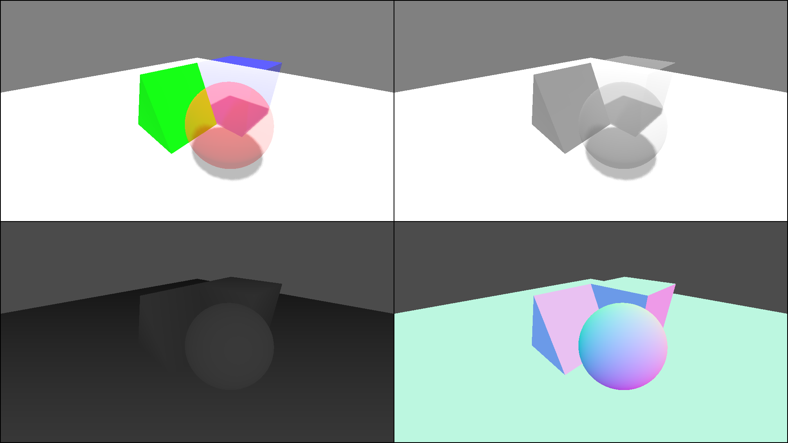
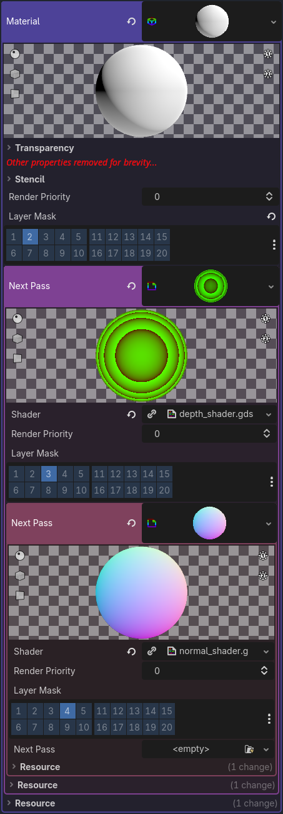
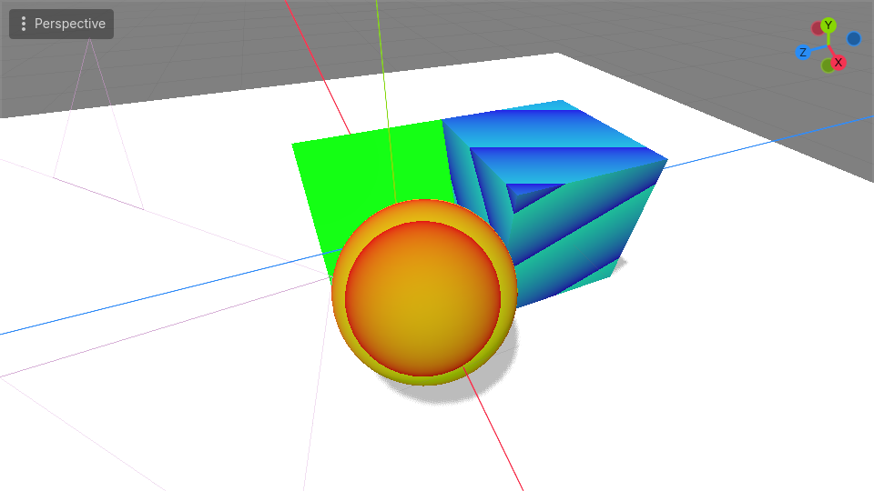

# Custom Screen Buffers

> **Note:** This branch (`requires-material-layer-mask`) was created using a version of Godot built from a PR branch, which hasn't been merged yet. The PR in question can be found here: [Add 'layer_mask' property to 'Material'](https://github.com/godotengine/godot/pull/116915). As suggested by the title, the PR adds a `layer_mask` property to 3D materials, allowing them to be culled on a per-layer basis, without having to rely on shader code that checks `CAMERA_VISIBLE_LAYERS`. This is faster and also allows the use of `StandardMaterial3D` and `ORMMaterial3D` in this project.
>
> If you think this would be a benefit to your project, give the PR a try to make sure it works as expected. You'll have to clone the PR branch and build from source. See [this doc](https://docs.godotengine.org/en/stable/engine_details/development/compiling/index.html) for more information about building from source.

This is a Godot 4.x project showcasing how to pass custom screen buffers around using viewports. These screen buffers can include various types of data, such as color, depth values, normal values, or other custom data, depending on your project's needs. These buffers can then be used in post-processing shaders in place of the built-in `hint_screen_texture`, `hint_depth_texture`, and `hint_normal_roughness_texture`.

## Contents
* [Motivation](#motivation)
* [Overview](#overview)
    * [Camera Scene](#camera-scene)
    * [Object Shaders](#object-shaders)
* [How To Use](#how-to-use)
   * [Use As Is](#use-as-is)
   * [Set Up From Scratch](#set-up-from-scratch)
      * [Notes On Passing Pure Data](#notes-on-passing-pure-data)
* [Limitations](#limitations) 

## Motivation

As of the creation of this project, Godot does not have a good system for creating and using custom buffers. You can access the color, depth, and normal-roughness buffers in screen-reading shaders (see [this doc](https://docs.godotengine.org/en/stable/tutorials/shaders/screen-reading_shaders.html)). However, these buffers are captured before the transparent geometry pass, so they can never contain any data about transparent objects. In addition, there is no way to pass custom data—only color, depth, and normal can be used. This project shows how to use viewports to overcome both of these limitations.

> **Note:** Currently Godot has a [Rendering Compositor](https://github.com/godotengine/godot-proposals/issues/7916) in the works. One of the plans for the compositor is the ability to capture and pass custom buffers from several points in the rendering pipeline, including after the transparent pass. As of Godot 4.3, there is already a new `CompositorEffect` object which partially implements this design. You can read more about how to use the `CompositorEffect` in [this doc](https://docs.godotengine.org/en/stable/tutorials/rendering/compositor.html).

## Overview

This project has two main parts that are necessary for achieving the custom buffer functionality:

* A **camera scene**, which captures the buffers and passes them to the post-processing shader

* A set of **object shaders**, which ensure each object renders itself properly to the different buffers

To see how these are used, take a look at **test_scene.tscn**. To change the final effect that is rendered, open **screen_shader.gdshader** and edit the `fragment()` function. Then run the test scene to see the result. In fact, there are already some lines of code that you can uncomment to see different results (color is displayed by default):

```glsl
// Set the screen shader to show info about this pixel (uncomment a line to view)
ALBEDO = color.rgb;                                // Color
//ALBEDO = vec3(color.r + color.g + color.b) / 3.0;  // Grayscale 
//ALBEDO = vec3(depth);                              // Depth
//ALBEDO = 0.5 * (normal + vec3(1.0));               // Normal
```

As you uncomment these lines, you should see results like the following:



> **Note:** The effect will only be visible when the project is running. The buffers are captured by actual cameras, which means the effect relies on having all of those cameras pointed in the same direction. Because of this, it will only be visible when the cameras are actually being used, that is, when the project is running. The effect won't work through the 3D viewport in the editor.

### Camera Scene

The scene **main_camera.tscn** contains the following nodes:
* 4 cameras (including the root `MainCamera`)
* 3 subviewports
* 1 full-screen quad (on which the post-processing shader **screen_shader.gdshader** is applied)

Think of this scene as single camera which captures all the necessary information and passes it to the post-processing effect on the full-screen quad. It captures color on layer 2, depth info on layer 3, and normal info on layer 4. Layer 1 is used as the "main" layer on which the post-processing effect is displayed.

> **Note:** Layer 1 is used in this way so that the full-screen quad does not interfere with the rendering of the color, depth, or normal buffers.

### Object Shaders

I've provided two shaders to use on all 3D objects: **depth_shader.gdshader** and **normal_shader.gdshader**. These allow the objects to render depth and normal values. Rendering color is handled by a `StandardMaterial3D`, but it could also be handled by an `ORMMaterial3D` or a custom shader.

These materials/shader are applied to a single mesh by chaining via the `next_pass` property. Each material is then set to render on the appropriate layer using the material's `layer_mask` property.

To see an example of this, take a look at any of the `MeshInstance3D` objects in **test_scene.tscn**. The materials are set on the mesh (not via the `material_override` or `material_overlay` properties).

## How To Use

This project can be used either as is (if all you need is the color, depth, and normal buffers), or it can be used as a point of reference as you set up your own project.

### Use As Is

To use this project without any modifications, simply add the **main_camera.tscn** scene wherever you would normally put a camera. Then, modify **screen_shader.gdshader** in order to define your post-processing shader. You will have access to the color, depth, and normal buffers in this shader.

> **Note:** There may be some limitations to how you can use **main_camera.tscn**. For example, I don't believe it will work properly to have two of them loaded at once in your project.

Finally, you'll need to set up your 3D objects. Make sure they are all rendering on layers 1 through 4. Then set up the material:

1. Set the material to whatever you want to use for the color buffer. Make sure its `layer_mask` property is set so that it is only rendering on layer 2.

2. On the color material (which you just set up in step 1), set the `next_pass` property to be a new `ShaderMaterial`. On this new `ShaderMaterial`, set the `shader` property to point to **depth_shader.gdshader**. Make sure its `layer_mask` property is set so that it only renders on layer 3.

3. On the depth material (which you just set up in step 2), set the `next_pass` property to be a new `ShaderMaterial`. On this new `ShaderMaterial`, set the `shader` property to point to **normal_shader.gdshader**. Make sure its `layer_mask` property is set so that it only renders on layer 4.

To see an example of how to set up the objects and their materials, you can take a look at **test_scene.tscn**. You can also refer to the image below:



### Set Up From Scratch

If you want to set this up from scratch in your own project, the general steps to take are as follows:

1. You'll need multiple cameras—one for each buffer that you want to capture. You'll want all of the cameras to have the same properties *except* that they should be on different visual layers. You'll also need to make it so that their 3D transforms match.

2. Add a `SubViewport` for each of the cameras. The viewports will need to be connected to their corresponding cameras. You can do this by writing a short script, which can be put on the cameras or on the viewports. You'll make use of the method `RenderingServer.viewport_attach_camera()` to attach the cameras to the viewports (see [here](https://docs.godotengine.org/en/stable/classes/class_renderingserver.html#class-renderingserver-method-viewport-attach-camera)).

3. Pass the resulting textures from these viewports as `sampler2D` uniforms to your post-processing shader. See [this doc](https://docs.godotengine.org/en/stable/tutorials/shaders/using_viewport_as_texture.html) for an example of how to do this.

4. Finally, you'll need to set up your objects with multiple materials chained on the `next_pass` property. Make sure each material has its `layer_mask` property set so that it renders to the appropriate layer. For your materials, you can use `StandardMaterial3D`, `ORMMaterial3D`, or `ShaderMaterial` with a spatial `Shader`.

#### Notes On Passing Pure Data

For any buffer where you plan to pass pure data (unaffected by lights or other visual effects), there are a few things you have to set up to ensure the data is passed unaltered:

* For the camera, add an `Environment` resource with default settings. This ensures that the camera uses linear tonemapping.

* For the viewport, make sure to enable the `use_hdr_2d` property. (The `Environment` resource could also be added to the viewport instead of the camera.)

* For the object shader, use `render_mode unshaded;` and write to `ALBEDO` in the `fragment()` function.

## Limitations

This project has some significant limitations. For that reason, it really should be considered a hack/workaround until the rendering compositor is completed.

The main limitations that I am aware of include:

* All buffers necessarily have the same format as a viewport texture: RGB8 (three channels of eight bits each). This is too much for some buffers and too little for others, so it's inefficient.

* The final effect can't be viewed in the editor.

* There's currently an issue in the editor, where the depth and normal shaders are affecting the rendering of transparent objects. I think this particular issue can be fixed, but haven't had time to figure out the best way.

  
